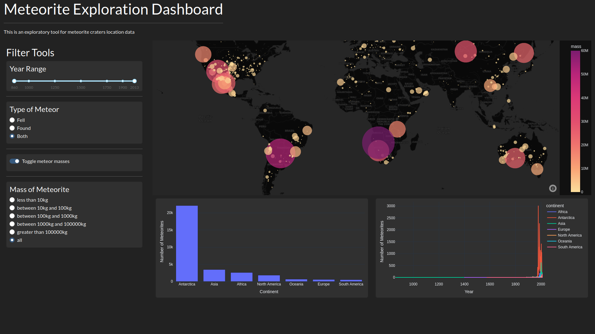

# Meteorite Dashboard
* author: Waiel TInwala
* link to the app: https://meteorite-dashboard.onrender.com
* link to the proposal: INSERT LINK HERE

# Dashboard Motivation

This dashboard is a convenient way to visualize the location as well as masses of meteorites spread out throughout the world between. The dashboard can be used to compare and contrast with different continents and their timelines of meteor hits throughout history (years 860-2013).

# Usage

The default view ofthe dashboard can be seen below

The different inputs for data exploration are available on the left side of the dashboard. Changing these will update the charts on the left based on the input values.

The first input is for a year range. You can select the range of years for which you want to see the meteorite location data.

The type of meteor can be switched between the following:
- Fell: these are meteors which were recorded as they were falling to the earth
- Found: these are meteors which were recorded after they had already fallen to earth
- Both: this option ccombines both **Fell** and **Found** meteors

The toggle switch will change the map so as to either reflect the size of each meteor or only show the location of them.

You can also select the range of masses for the different meteors. Most of the meteors may not be visible as they are masked by the very heavy ones. This option will limit the ranges so that the user is able to compare sizes of smaller meteors.

# References
1. dataset:  https://data.nasa.gov/Space-Science/Meteorite-Landings/gh4g-9sfh
2. dashboard framework: https://dash.plotly.com/
3. dashboard plots: https://plotly.com/python/?_ga=2.70909968.1883871794.1679446955-1270481071.1677827357

# License

Licensed under the terms of MIT License.